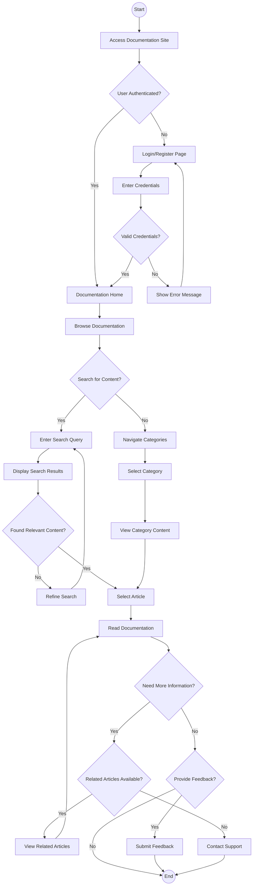

# Flowchart Diagram

## Description
user flow

## Diagram

```mermaid
flowchart TD
    A(("Start")) --> B["Access Documentation Site"]
    B --> C{"User Authenticated?"}
    C -->|"No"| D["Login/Register Page"]
    C -->|"Yes"| E["Documentation Home"]
    D --> F["Enter Credentials"]
    F --> G{"Valid Credentials?"}
    G -->|"No"| H["Show Error Message"]
    H --> D
    G -->|"Yes"| E
    E --> I["Browse Documentation"]
    I --> J{"Search for Content?"}
    J -->|"Yes"| K["Enter Search Query"]
    J -->|"No"| L["Navigate Categories"]
    K --> M["Display Search Results"]
    M --> N{"Found Relevant Content?"}
    N -->|"No"| O["Refine Search"]
    O --> K
    N -->|"Yes"| P["Select Article"]
    L --> Q["Select Category"]
    Q --> R["View Category Content"]
    R --> P
    P --> S["Read Documentation"]
    S --> T{"Need More Information?"}
    T -->|"Yes"| U{"Related Articles Available?"}
    T -->|"No"| V{"Provide Feedback?"}
    U -->|"Yes"| W["View Related Articles"]
    U -->|"No"| X["Contact Support"]
    W --> S
    V -->|"Yes"| Y["Submit Feedback"]
    V -->|"No"| Z(("End"))
    Y --> Z
    X --> Z
```

---
*Generated by PUG (Pure UpGrade) on 9/20/2025*
