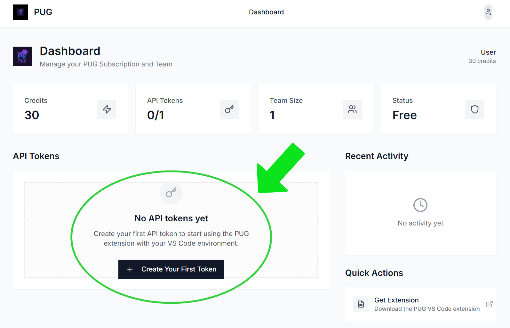
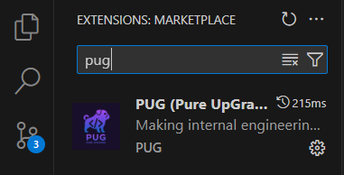
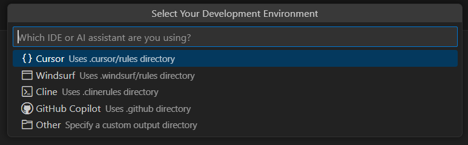

<video
  autoPlay
  muted
  loop
  playsInline
  className="w-full aspect-video rounded-xl"
  src="/videos/Pug_And_Logo_Animation.mp4"
></video>

### Step 1: Installation

<AccordionGroup>
  <Accordion icon="copy" title="Part 1: Set up dashboard">
    1. Click Install PUG on the homepage of the website
    2. Once you enter your email, you should get an email with a link to the dashboard
    3. Create PUG token and copy it
    
  </Accordion>
  <Accordion icon="copy" title="Part 2: Install extension on IDE Extension store">
    Open Extension store in your IDE, search for PUG (Pure UpGrade), and install
    
  </Accordion>
</AccordionGroup>

### Step 2: Configure PUG

<AccordionGroup>
  <Accordion icon="github" title="Part 3: Use the PUG token">
    1. Open the extension on your IDE using the shortcut **Command+Shift+D** on Mac (or **Ctrl+Shift+D** on Windows/Linux)
    2. Paste PUG token
    3. Select which folder name your want the docs to be stored in on your IDE
    

    <Tip>You can give the folder anyname, it doesn't matter</Tip>

    **_Installation Finished!_**
</Accordion>
</AccordionGroup>

## Next steps

Now that you have PUG installed, explore these key features:

<CardGroup cols={2}>

<Card title="Export & Integrations" icon="pen-to-square" href="/overview">
  Connect and export to Confluence, Notion, or where ever your company stores docs
</Card>

</CardGroup>

